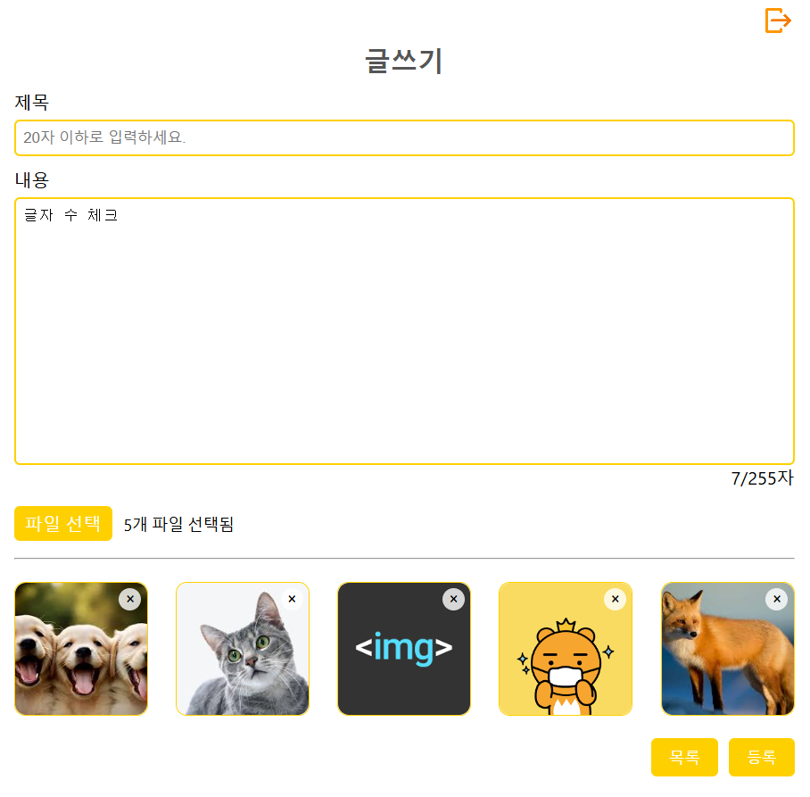
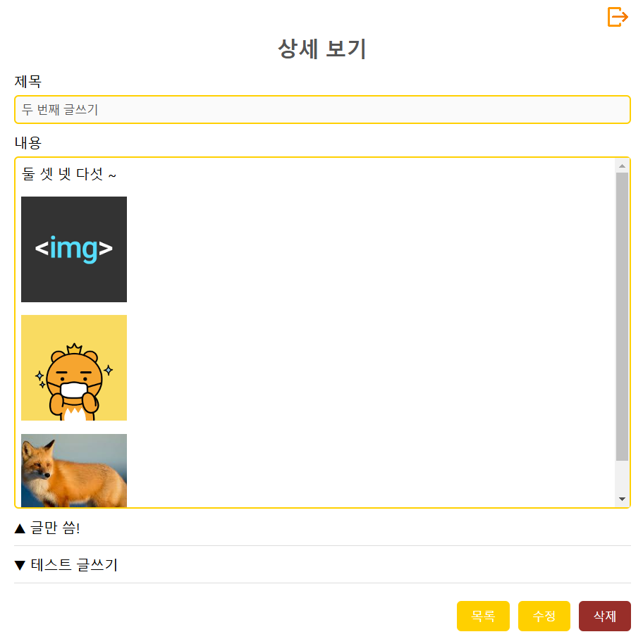
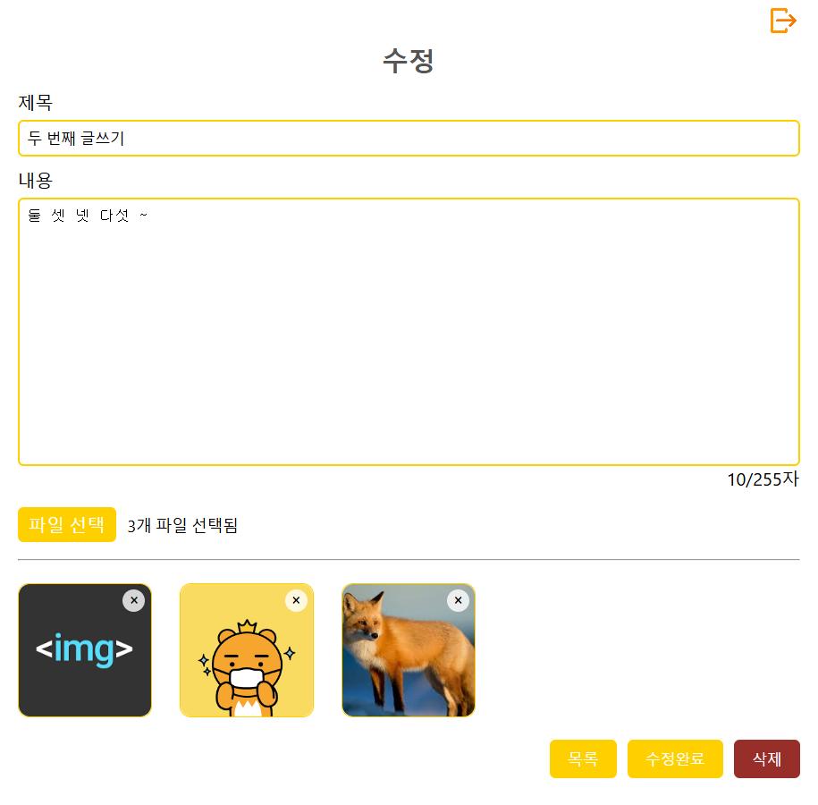

# 📝 SimpleBoard

Spring boot + React 심플한 게시판


# 📚 목차

1. [제작기간 및 참여인원](#-제작기간-및-참여인원)
2. [기술스택](#-기술스택)
3. [ERD](#%EF%B8%8F-erd)
4. [화면구성 및 기능](#-화면구성-및-기능)
5. [트러블 슈팅](#-트러블-슈팅)

<br>

# 👋🏻 제작기간 및 참여인원

### 제작기간
2024-10-07 ~ 2024-10-25

### 참여인원
개인 프로젝트 (총 1명)<br>

<table>
  <tr>
    <td align="center" width="180px">
      <a href="https://github.com/Ji-Yoon98" target="_blank">
        
      </a>
    </td>
  </tr>
    
  <tr>
    <td align="center">
      <a href="https://github.com/Ji-Yoon98" target="_blank">
        박지윤<br />
       FrontEnd & BackEnd
      </a>
    </td>
  </tr>
</table>

<br>

[목차🔺](#-목차)
<br><br>

# 🛠 기술스택

### Environment
&nbsp;
&nbsp;


<br>

### FrontEnd
&nbsp;
&nbsp;
&nbsp;


<br>

### BackEnd
&nbsp;
&nbsp;
&nbsp;
&nbsp;
<br>

<br>

[목차🔺](#-목차)


# ⚙️ ERD


<br>

[목차🔺](#-목차)
<br><br>

# 💻 화면구성 및 기능

### 메인화면
<table>
  <thead>
    <tr>
      <th style="text-align: center;">메인화면</th>
    </tr>
  </thead>
  <tbody>
    <tr>
      <td align="center">
        <a href="imges/main.png" target="_blank">
          
        </a>
      </td>
    </tr>
  </tbody>
</table>

- **Login**: 로그인 페이지로 이동
- **Board**: 게시판 목록으로 이동 (비회원 유저도 게시판을 볼 수 있음)

<br><br>

### 로그인 / 회원가입
<table>
  <thead>
    <tr>
      <th style="text-align: center;">로그인</th>
      <th style="text-align: center;">회원가입</th>
    </tr>
  </thead>
  <tbody>
    <tr>
      <td align="center">
        <a href="imges/login.png" target="_blank">
          
        </a>
      </td>
      <td align="center">
        <a href="imges/join.png" target="_blank">
          
        </a>
      </td>
    </tr>
  </tbody>
</table>

- **로그인**
  - id, pw 입력 후 로그인
  - id가 없거나 pw가 맞지 않는 경우 경고창
  - id, pw 미입력 시 경고창
  - 회원가입 페이지로 넘어갈 수 있음
  - 뒤로 버튼 누르면 메인페이지로 이동

- **회원가입**
  - id, pw, pw확인, 이름, 이메일 미입력시 경고창
  - pw, pw확인이 맞지 않을 경우 경고창
  - id, email은 중복확인
  - 중복확인을 하지 않았을 경우 경고창
 
<br><br>
 
### 게시판 목록
<table>
  <thead>
    <tr>
      <th style="text-align: center;">게시판 목록</th>
      <th style="text-align: center;">내 글만 보기</th>
      <th style="text-align: center;">글 쓴 회원 정보</th>
      <th style="text-align: center;">검색</th>
    </tr>
  </thead>
  <tbody>
    <tr>
      <td align="center">
        <a href="imges/board.png" target="_blank">
          
        </a>
      </td>
      <td align="center">
        <a href="imges/myBoard.png" target="_blank">
          
        </a>
      </td>
      <td align="center">
        <a href="imges/user.png" target="_blank">
          
        </a>
      </td>
      <td align="center">
        <a href="imges/search.png" target="_blank">
          
        </a>
      </td>
    </tr>
  </tbody>
</table>

- **게시판 목록**
  - 로그인을 한 경우 header에 로그아웃 icon이 보임
  - 한 페이지에 게시글은 10개까지 나옴
  - 페이징은 5페이지까지 나옴
  - <, > 클릭시 5페이지씩 이동 (1페이지 -> 6페이지로 이동)
  - 파일이 첨부된 게시물은 제목 뒤에 파일 icon이 포함되서 보임
  - 번호, 작성일, 조회수 순으로 정렬 가능 (default - 작성일)
  - 뒤로 버튼 누르면 메인페이지로 이동

- **내 글만 보기**
  - 내 글만 보기 체크 시 현재 로그인한 유저의 글만 나옴
  - 쓴 게시글이 없으면 "게시물이 없습니다"
  
- **글 쓴 회원정보**
  - 게시판 목록에서 작성자 이름을 클릭하면 그 게시물 작성자의 정보가 나옴

- **검색**
  - 전체, 제목, 작성자, 내용 카테고리 및 검색어로 검색 
  
<br><br>

### 글쓰기 / 상세보기 / 수정
<table>
  <thead>
    <tr>
      <th style="text-align: center;">글쓰기</th>
      <th style="text-align: center;">상세보기</th>
      <th style="text-align: center;">수정</th>
    </tr>
  </thead>
  <tbody>
    <tr>
      <td align="center">
        <a href="imges/write.png" target="_blank">
          
        </a>
      </td>
      <td align="center">
        <a href="imges/boardDetail.png" target="_blank">
          
        </a>
      </td>
      <td align="center">
        <a href="imges/update.png" target="_blank">
          
        </a>
      </td>
    </tr>
  </tbody>
</table>

- **글쓰기**
  - 로그인한 회원만 쓸 수 있음, 비회원은 로그인 페이지로 이동
  - 제목은 20자로 제한, 내용은 255자로 제한
  - 실시간으로 글자수 개수를 표시
  - jpg, png 등 이미지 파일만 등록이 가능 (다른 파일 업로드 시 경고창)
  - 파일은 5개까지만 등록이 가능 (5개 이상 등록 -> 경고창)
  - 최대 파일 용량을 넘기면 경고창 (10MB)
  - 등록할 파일을 미리보기로 보여줌 (미리보기 이미지의 X 버튼 클릭하면 삭제)

- **상세보기**
  - 제목과 내용이 보임
  - 내용 안에 내가 첨부한 이미지 파일들이 나옴
  - ▲ 다음 글, ▼ 이전 글로 이동 
  - 내가 쓴 글이면 하단에 수정, 삭제 버튼이 보임
  - 수정 버튼 클릭 시 수정 페이지로 이동
  - 삭제 버튼 클릭 시 삭제 확인 alert창 뜨고 확인 누르면 삭제됨
 
- **수정**
  - 제목, 내용, 첨부된 파일이 나옴
  - 다시 파일 선택 시 기존에 첨부된 파일 + 새로 추가한 파일이 미리보기로 나옴
 
<br><br>

  

[목차🔺](#-목차)
<br><br>


# 💊 트러블 슈팅

<details>

<summary>Security 세션 로그인 시 React에서의 로그인 유지 안됌</summary>
<br>

Security를 통한 세션 로그인 시 React에서 새로고침이나 페이지 이동 시 초기화되어 로그인 상태가 유지되지 않는 문제가 발생함

```java
public class SecurityConfig {

	@Bean
	public SecurityFilterChain filterChain(HttpSecurity http) throws Exception {
		
		http.csrf((auth) -> auth.disable());
		
		http.cors((cors) -> cors.configurationSource(corsConfigurationSource()));

	    // From 로그인 방식
	    http.formLogin((auth) -> auth
	    		.loginPage("/login")
	    		.defaultSuccessUrl("/loginOk")
	    		.failureHandler(customFailureHandler)
	    		.permitAll());
	    
	    // 로그아웃
	    http.logout((logout) -> logout
				.logoutUrl("/logout")
				.logoutSuccessUrl("/logoutOk")
				.deleteCookies("JSESSIONID"));

	
	    // HTTP Basic 인증 방식 disable
	    http.httpBasic((auth) -> auth.disable());
	
		// 경로별 인가 작업(일단 전체 열어둠)
		http.authorizeHttpRequests((auth) -> auth
				.requestMatchers("/**").permitAll()
				.anyRequest().authenticated());
		
	
		return http.build();
	}
	
}

```

```java
// 시큐리티 로그인 성공 -> 로그인 한 유저 값 넘김
@GetMapping("/loginOk")
public ResponseEntity<Map<String, String>> loginOk() {
  String username = userService.getUsername();

  System.out.println("로그인한 유저:" + username);

  Map<String, String> userInfo = new HashMap<>();
  userInfo.put("username", username);

  return ResponseEntity.ok(userInfo);
}
```

- SecurityConfig에서 defaultSuccessUrl을 "/loginOk"로 줌 (defaultSuccessUrl = 로그인 성공 시 이동할 경로)
- 컨트롤러에서 loginOk라는 경로로 로그인한 유저의 정보를 넘겨줌

</br></br>  

</details>


[목차🔺](#-목차)

