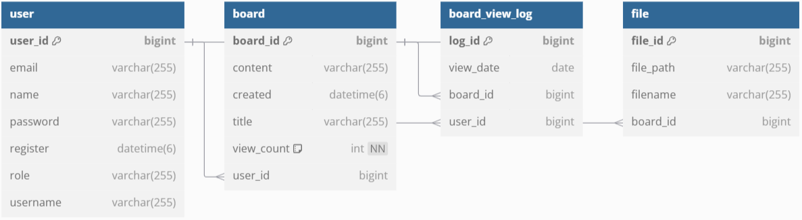

# 📝 SimpleBoard

Spring boot + React 심플한 게시판

# 📚 목차

1. [제작기간 및 참여인원](#-제작기간-및-참여인원)
2. [기술스택](#-기술스택)
3. [ERD](#%EF%B8%8F-erd)
4. [화면구성 및 기능](#%EF%B8%8F-화면구성-및-기능)
5. [트러블 슈팅](#-트러블-슈팅)

 

# 👋🏻 제작기간 및 참여인원

### 제작기간
2024-10-07 ~ 2024-10-25

### 참여인원
개인 프로젝트 (총 1명) 

<table>
  <tr>
    <td align="center" width="180px">
      
    </td>
  </tr>
    
  <tr>
    <td align="center">
      <a href="https://github.com/Ji-Yoon98" target="_blank">
        박지윤 
       FrontEnd & BackEnd
      </a>
    </td>
  </tr>
</table>

 

[목차🔺](#-목차)
  

# 🛠 기술스택

### Environment
&nbsp;
&nbsp;

 

### FrontEnd
&nbsp;
&nbsp;
&nbsp;

 

### BackEnd
&nbsp;
&nbsp;
&nbsp;
&nbsp;
 

 

[목차🔺](#-목차)

# ⚙️ ERD

 

[목차🔺](#-목차)
  

# 🖥️ 화면구성 및 기능

### ** User **

<table>
  <thead>
    <tr>
      <th style="text-align: center;">회원가입</th>
      <th style="text-align: center;">회원 항목 입력</th>
      <th style="text-align: center;">이메일 인증</th>
    </tr>
  </thead>
  <tbody>
    <tr>
      <td align="center">
        
      </td>
      <td align="center">
        
      </td>
      <td align="center">
        
      </td>
    </tr>
  </tbody>
</table>

- 회원가입

  - **사용자 정보 수집 및 유효성 검사**: 사용자로부터 필요한 정보를 입력받고, 이메일 형식, 비밀번호 강도 등을 확인하여 유효한 데이터인지 검증.
  - **중복 확인**: 이미 등록된 사용자인지 확인하기 위해 이메일 주소 등의 고유한 정보를 기준으로 중복 여부를 확인
  - **비밀번호 암호화 및 안전한 저장**: Spring Security의 암호화 기능을 이용하여 사용자의 비밀번호를 안전하게 해시화하고, 안전한 방식으로 데이터베이스에 저장.

    

<table>
  <thead>
    <tr>
      <th style="text-align: center;">로그인</th>
      <th style="text-align: center;">아이디 찾기</th>
      <th style="text-align: center;">비밀번호 찾기</th>
    </tr>
  </thead>
  <tbody>
    <tr>
      <td align="center">
        
      </td>
      <td align="center">
        
      </td>
      <td align="center">
        
      </td>
    </tr>
  </tbody>
</table>

- 로그인
  - **인증 프로세스 구현**: Spring Security를 사용하여 사용자가 제공한 인증 정보(일반적으로 아이디와 비밀번호)를 검증, 이를 통해 사용자가 시스템에 접근 가능한지 확인
  - **비밀번호 해싱 및 매칭**: 사용자가 제공한 비밀번호를 Spring Security의 암호화 기능을 활용하여 저장된 해시된 비밀번호와 비교
  - **인가 및 권한 부여**: Spring Security를 사용하여 특정한 권한이 필요한 경우, 해당 권한을 가진 사용자만이 특정 기능 또는 페이지에 접근할 수 있도록 제어
  - **보안 강화 및 로그인 관련 설정**: CSRF(Cross-Site Request Forgery) 공격 등에 대비하기 위한 설정 및 보안 강화를 위한 다양한 옵션들을 활용하여 로그인 시스템을 안전하게 구성

   

- 아이디 찾기
  - **이름, 생년월일, 이메일 주소 입력**: 사용자가 등록한 이름, 생년월일, 이메일 주소를 입력
  - **검증 및 일치 여부 확인**: 입력된 값들이 데이터베이스에 등록되어 있는지 확인 등록된 값이라면 해당하는 아이디를 사용자에게 모달창으로 알려줌.

- 비밀번호 재설정(비밀번호 찾기)
  - **아이디, 생년월일, 이메일 주소** : 사용자가 등록한 아이디, 생년월일, 이메일 주소를 통해 신원을 확인
  - **신원 확인 후 비밀번호 재설정**: 신원 확인이 성공하면, 비밀번호를 재설정 하여 사용자 이메일로 전송, 해당 비밀번호는 암호화 후 데이터베이스에 저장
  - **안내 및 완료**: 비밀번호가 성공적으로 변경되었음을 사용자에게 안내하고, 로그인할 수 있는 새로운 정보를 제공

   
