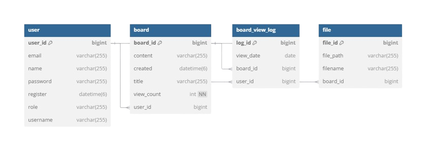
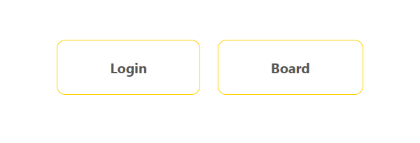
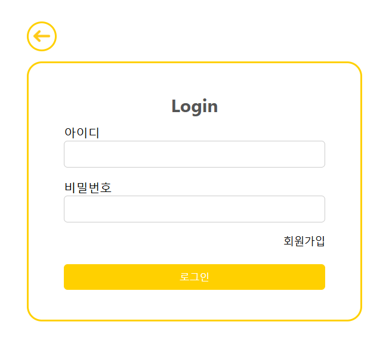
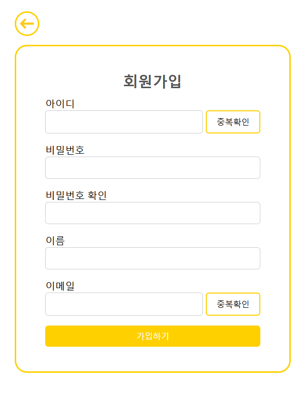
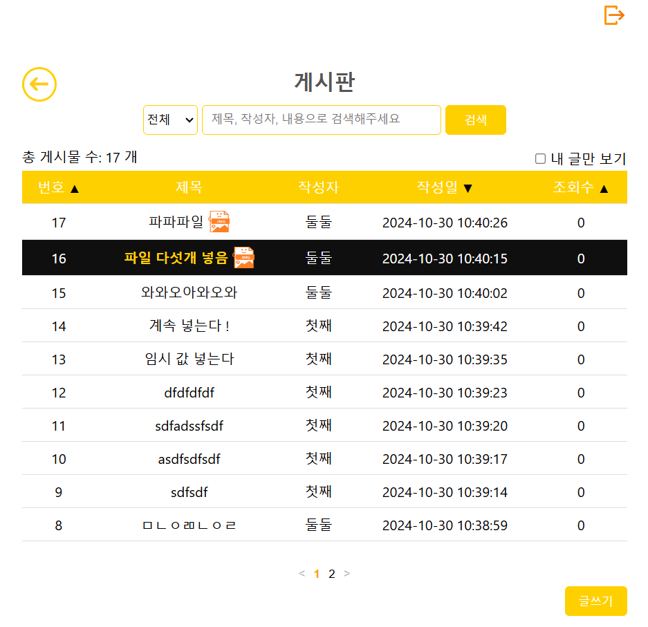
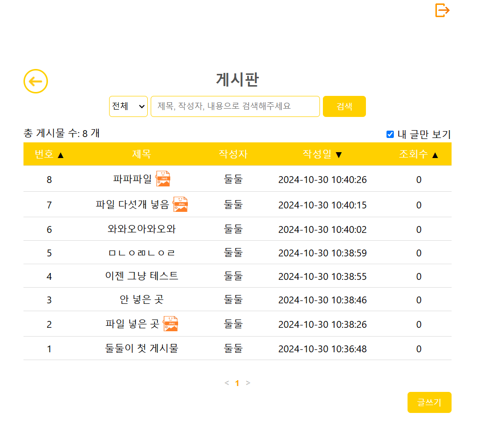
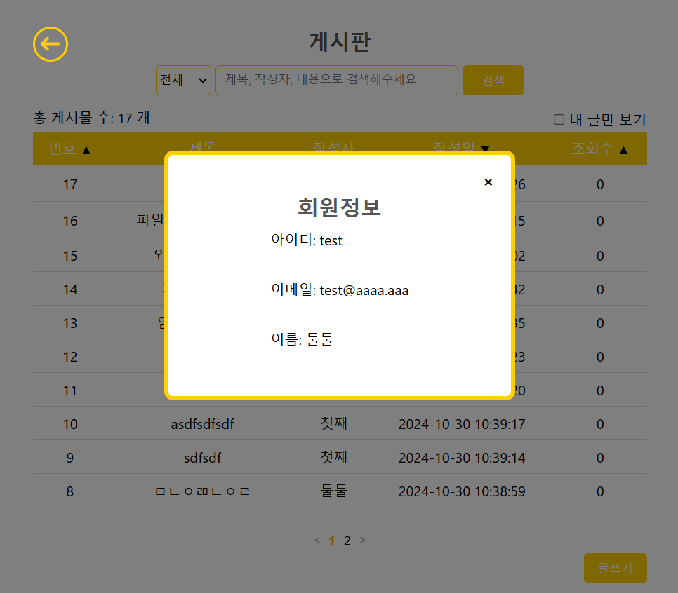
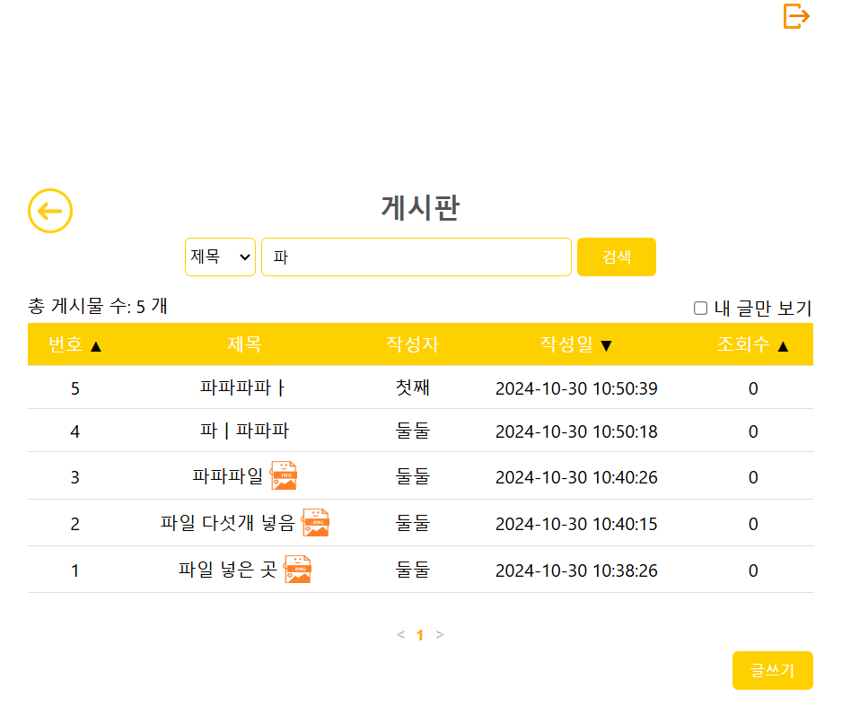

# 📝 SimpleBoard

Spring boot + React 심플한 게시판

# 📚 목차

1. [제작기간 및 참여인원](#-제작기간-및-참여인원)
2. [기술스택](#-기술스택)
3. [ERD](#%EF%B8%8F-erd)
4. [화면구성 및 기능](#%EF%B8%8F-화면구성-및-기능)
5. [트러블 슈팅](#-트러블-슈팅)

 

# 👋🏻 제작기간 및 참여인원

### 제작기간
2024-10-07 ~ 2024-10-25

### 참여인원
개인 프로젝트 (총 1명) 

<table>
  <tr>
    <td align="center" width="180px">
      
    </td>
  </tr>
    
  <tr>
    <td align="center">
      <a href="https://github.com/Ji-Yoon98" target="_blank">
        박지윤 
       FrontEnd & BackEnd
      </a>
    </td>
  </tr>
</table>

 

[목차🔺](#-목차)
  

# 🛠 기술스택

### Environment
&nbsp;
&nbsp;

 

### FrontEnd
&nbsp;
&nbsp;
&nbsp;

 

### BackEnd
&nbsp;
&nbsp;
&nbsp;
&nbsp;
 

 

[목차🔺](#-목차)

# ⚙️ ERD

 

[목차🔺](#-목차)
  

# 💻 화면구성 및 기능

### 메인화면
<table>
  <thead>
    <tr>
      <th style="text-align: center;">메인화면</th>
    </tr>
  </thead>
  <tbody>
    <tr>
      <td align="center">
        
      </td>
    </tr>
  </tbody>
</table>

- **Login**: 로그인 페이지로 이동
- **Board**: 게시판 목록으로 이동 (비회원 유저도 게시판을 볼 수 있음)

  

### 로그인 / 회원가입
<table>
  <thead>
    <tr>
      <th style="text-align: center;">로그인</th>
      <th style="text-align: center;">회원가입</th>
    </tr>
  </thead>
  <tbody>
    <tr>
      <td align="center">
        
      </td>
      <td align="center">
        
      </td>
    </tr>
  </tbody>
</table>

- **로그인**
  - id, pw 입력 후 로그인
  - id가 없거나 pw가 맞지 않는 경우 경고창
  - id, pw 미입력 시 경고창
  - 회원가입 페이지로 넘어갈 수 있음
  - 뒤로 버튼 누르면 메인페이지로 이동

- **회원가입**
  - id, pw, pw확인, 이름, 이메일 미입력시 경고창
  - pw, pw확인이 맞지 않을 경우 경고창
  - id, email은 중복확인
  - 중복확인을 하지 않았을 경우 경고창
 
  
 
### 게시판 목록
<table>
  <thead>
    <tr>
      <th style="text-align: center;">게시판 목록</th>
      <th style="text-align: center;">내 글만 보기</th>
      <th style="text-align: center;">글 쓴 회원 정보</th>
      <th style="text-align: center;">검색</th>
    </tr>
  </thead>
  <tbody>
    <tr>
      <td align="center">
        
      </td>
      <td align="center">
        
      </td>
      <td align="center">
        
      </td>
      <td align="center">
        
      </td>
    </tr>
  </tbody>
</table>

- **게시판 목록**
  - 로그인을 한 경우 header에 로그아웃 icon이 보임
  - 게시글은 10개까지만 한 페이지에 나옴
  - 파일이 첨부된 게시물은 제목 뒤에 파일 이미지가 포함되서 보임
  - 번호, 작성일, 조회수 순으로 정렬 가능 (default - 작성일)
  - 뒤로 버튼 누르면 메인페이지로 이동

- **내 글만 보기**
  - 내 글만 보기 체크 시 현재 로그인한 유저의 글만 나옴
  
- **글 쓴 회원정보**
  - 게시판 목록에서 작성자 이름을 클릭하면 그 게시물 작성자의 정보가 나옴

- **검색**
  - 전체, 제목, 작성자, 내용의 카테고리 및 검색어로 검색 
  
  

  

[목차🔺](#-목차)
  

